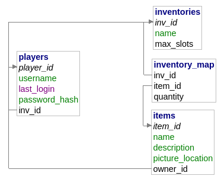

# P.P. V1 Api

## Below are links to the docs of the PP API (v1).

### [Endpoints](./endpoints.md)
### [Objects](./objects.md)
### [Errors](./errors.md)

---

View the project on [GitHub](https://github.com/alexkirwan29/Programming-Playground). Fork it, I dare you.

Join the discord discussion at [the Discord](https://discord.gg/yQYbUQJ)

---

## Database Table Relations

---
API prepared by [Those45Ninjas](https://github.com/those45ninjas).

